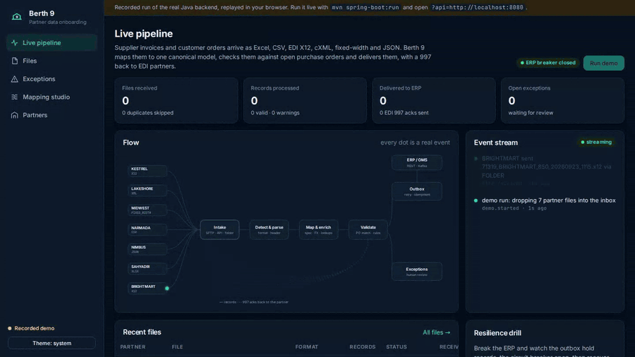
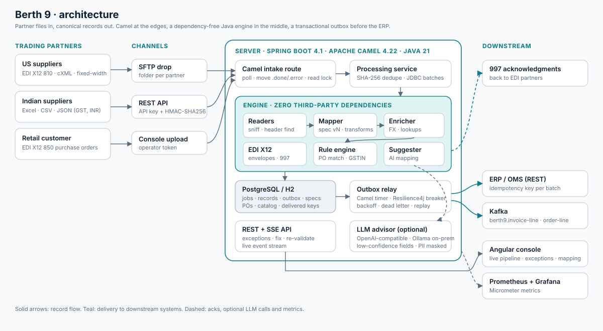
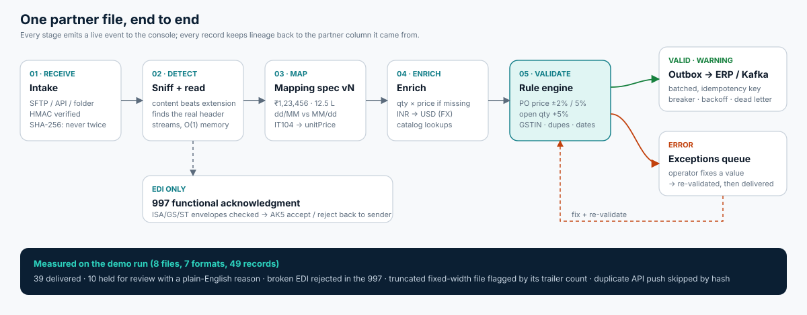

<div align="center">

# Berth 9

**Partner data onboarding and B2B integration engine: messy supplier files in, clean canonical records out.**

[](https://github.com/lakshaysharmaug22-crypto/berth9/actions/workflows/ci.yml)


**[Live console →](https://berth9.vercel.app)** &nbsp;·&nbsp; [Architecture](#architecture) &nbsp;·&nbsp; [Run it locally](#run-it-locally) &nbsp;·&nbsp; [Design decisions](#design-decisions)



</div>

## The problem

A distributor buys from hundreds of suppliers and sells to retailers. Every one of them sends data differently: a US fastener maker sends **EDI X12 810** invoices over SFTP, a packaging company posts **cXML**, an Indian polymer supplier emails an **Excel register** with a company banner, merged headers and lakh-grouped rupees, a legacy bearing distributor exports **fixed-width** files from an AS/400, a retailer sends **EDI 850** purchase orders. Somebody has to turn all of it into one shape, check it against open purchase orders, and push only the clean part into the ERP.

Berth 9 is that "first mile". It is named after the dock berth where incoming cargo is unloaded, checked and cleared before it moves inland.

## What it does

| Stage | What happens |
|---|---|
| **Receive** | Files arrive by SFTP, a signed REST API (API key + HMAC-SHA256 + timestamp) or a watched folder. Identical content is recognised by SHA-256 and never processed twice. |
| **Detect and read** | Format is sniffed from content, not the extension. Readers stream CSV, Excel, EDI X12, XML (cXML), fixed-width and JSON. The real header is found under banners and title rows, two-row merged headers are combined (`Tax (INR)` + `CGST` → `Tax (INR) CGST`), and footers and repeated page headers are dropped. |
| **Map** | A versioned mapping spec per partner. Transforms understand `$1,234.50`, `₹1,23,456.00`, `12.5 L`, `1.2 Cr`, `(1,200.00)`, implied decimals, Excel date serials and strict date patterns. |
| **Enrich** | Missing line amounts are computed, INR is converted to USD, and blanks are filled from the catalog. |
| **Validate** | A declarative rule engine checks the PO (exists, same supplier and currency), price variance (warning above 2%, error above 5%), open quantity (+5% tolerance), line math, duplicates in the file and across earlier files, GSTIN format and check digit, HSN codes and date windows. |
| **Deliver** | Valid records go through a transactional outbox to the ERP (REST, idempotency key per batch) and optionally Kafka. A Resilience4j circuit breaker, exponential backoff and a dead-letter state mean an ERP outage loses nothing. |
| **Acknowledge** | EDI partners get a **997** back with AK5 accept or reject per transaction set, built from real envelope checks (ISA/IEA and GS/GE control numbers, SE01 segment counts). |
| **Review** | Failed records wait in an exceptions queue with a plain-English reason. An operator fixes a value, the record is re-validated against the same rules and flows on. |
| **Onboard** | **Mapping studio**: drop a sample file from a new partner and get a proposed mapping with a confidence score and the reasons behind it. A rules matcher settles most fields for free; only low-confidence fields are sent to an optional local LLM (OpenAI-compatible, Ollama by default) with PII masked. |

### Measured on the recorded demo run

8 files in 7 document formats from 7 partners: **49 records, 39 delivered, 10 held** for review, each for a real reason. The broken EDI transmission was rejected in the 997 with `AK5*R*4`, the fixed-width file whose trailer claimed 8 lines but carried 7 was flagged, and a re-sent API payload was skipped by hash. The engine module has **40 unit tests**.

## Architecture





**Enterprise integration patterns in the code:** channel adapter, content-based format detection, normalizer / canonical data model, message translator, content enricher, idempotent receiver, transactional outbox, circuit breaker, retry with backoff, dead letter channel, message history (lineage per field), wire tap (live event stream).

### Modules

```
berth9-engine/    Plain Java 21, zero third-party dependencies. Readers, EDI X12 parser + 997 builder,
                  transforms, mapper, enricher, sealed-type rule engine, mapping suggester, CLI.
berth9-server/    Spring Boot 4.1 + Apache Camel 4.22. Intake routes, processing, SQL (JdbcClient + Flyway),
                  outbox relay, REST + Server-Sent Events, partner auth, mock ERP with chaos controls.
berth9-console/   Angular 21 standalone app: live pipeline, files, exceptions, mapping studio, partners.
                  Responsive down to phone width, light and dark themes.
samples/          Generator for the fictional demo data: partner files plus purchase orders, catalog, FX.
deploy/           Dockerfile and a Compose stack with PostgreSQL, SFTP, Kafka, Prometheus and Grafana.
```

## Tech stack

**Backend:** Java 21 (records, sealed interfaces, pattern-matching switch, virtual threads) · Spring Boot 4.1 · Apache Camel 4.22 LTS · Spring JDBC `JdbcClient` · Flyway · PostgreSQL / H2 · Resilience4j · Apache POI · StAX with XXE hardening · Kafka · Micrometer + Prometheus

**Frontend:** Angular 21 (standalone components, signals, new control flow) · TypeScript · SVG animation · Server-Sent Events

**Quality and ops:** JUnit 5 · GitHub Actions · Docker Compose · Grafana

## Run it locally

Needs JDK 21 and Maven 3.9. No database or broker: the default profile uses in-memory H2 and a local inbox folder.

```bash
mvn -B verify
java -jar berth9-server/target/berth9-server-1.0.0.jar
```

Open http://localhost:8080 and press **Run demo**. The bundled partner files are dropped into `data/inbox/<PARTNER>/` exactly as an SFTP upload would, and the real intake route picks them up. You can also drop your own files there.

**Full stack with Docker** (PostgreSQL, SFTP on port 2222, Kafka, Prometheus, Grafana on port 3000):

```bash
docker compose -f deploy/docker-compose.yml up --build
```

**Engine on its own**, no server:

```bash
java -jar berth9-engine/target/berth9-engine-1.0.0.jar suggest --config berth9-server/src/main/resources/berth9 \
     --schema invoice-line --locale US samples/extra/coastal_chem_invoice_lines.csv
java -jar berth9-engine/target/berth9-engine-1.0.0.jar ack997 samples/extra/KESTREL_810_20260923_0815_broken.x12
```

**Point the hosted console at your local backend:** open the live console with `?api=http://localhost:8080`.

### API

```bash
# Partner push over the signed API: signature = hex(HMAC-SHA256(secret, "<timestamp>." + body))
curl -X POST http://localhost:8080/api/inbound/NIMBUS -H 'Content-Type: application/json' \
     -H 'X-Api-Key: pk_nimbus' -H "X-Timestamp: $TS" -H "X-Signature: $SIG" --data-binary @invoice.json

curl http://localhost:8080/api/overview          # totals, breaker state, recent files
curl http://localhost:8080/api/exceptions        # records waiting for review, with reasons
curl http://localhost:8080/api/jobs/1/ack        # the 997 sent back for an EDI file
curl -N http://localhost:8080/api/events         # live event stream (SSE)
```

## Design decisions

- **The engine has no dependencies.** Parsing, mapping and validation are the valuable part and should run anywhere: in the server, a batch job, a CLI, a serverless function. Spring and Camel stay at the edges, where they add real value (connectors, polling, lifecycle).
- **Camel for the edges, a plain loop in the middle.** Camel owns the file/SFTP consumer, read locks, `.done`/`.error` moves and the outbox timer. Records of a file are processed by the engine's streaming loop and written in JDBC batches instead of one Camel exchange per record, which keeps per-record overhead low.
- **Transactional outbox instead of calling the ERP inline.** Records are committed as `VALID` first and delivered by a relay. An ERP outage never fails an intake, and every retry is idempotent (an idempotency key per batch plus a delivered-keys table).
- **Plain SQL instead of JPA.** The data model is small and the queries matter (outbox claims, counters, reference lookups), so they are written and indexed by hand.
- **997 is syntax, not business.** The 997 only says whether the interchange was structurally valid X12. Business rejections (price above PO) are held in the exceptions queue; in X12 terms they belong in an 824 application advice, not the 997.
- **Rules first, LLM second.** Most mapping decisions are settled by header similarity plus value profiling. That is deterministic, explainable and free. A language model only sees fields the rules could not settle, runs on-prem by default, and never sees raw PII.
- **Ambiguous dates are never guessed silently.** If every sample of `03/09/2026` could be either order, the suggester picks from the partner's locale and says so in the reasons.

## Project status

This is a portfolio project. All companies, people, GSTINs and purchase orders in the demo data are fictional (generated by `samples/generate.py`); GSTINs carry valid check digits so the checksum rule can be exercised.

## License

MIT
